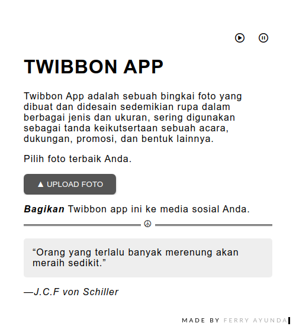

  <h1 align="left">Simple Twibbon Progressive Web App (PWA)</h1>

This is a simple page for a Progressive Web App (PWA)

  

---

## About

Displays a simple twibbon PWA demo. Implemented here using the program manifest, service workers, and storage. In this version, it is possible to define the first page, the default offline page, and the pages that should not be cached.

## Demo

https://dialu.pages.dev/
